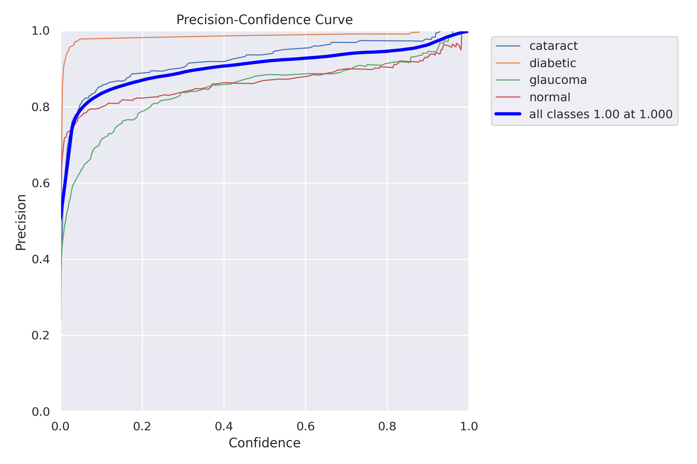

# Eye_Illness_Det
AUTOMATED ASSISTIVE SCREENING OF RETINAL PATHOLOGY THROUGH ADVANCED NEURAL NETWORK [Classes Detected: Diabetic Retinopathy, Glaucoma, Cataract &amp; Normal.] 

## Contents

- [Evaluation Metrics](#evaluation-metrics)
  - [Confusion Matrix](#confusion-matrix)
  - [Result and Graphs](#result-and-graphs)
  - [Validation Batch Images](#validation-batch-images)

## Evaluation Metrics

| Metrics | Precision (P) | Recall (R) | mAP50 | mAP50-95 |
|---------|----------------|------------|-------|----------|
| Overall | 0.908          | 0.936      | 0.966 | 0.964    |
| Cataract | 0.927         | 1.000      | 0.921 | 0.978    |
| Diabetic | 0.977         | 0.995      | 0.971 | 0.995    |
| Glaucoma | 0.874         | 0.900      | 0.947 | 0.945    |
| Normal | 0.830           | 0.944      | 0.943 | 0.943    |

### Confusion Matrix:

*Figure 1.1: Confusion Matrix depicting the model's performance on selected classes.*

### Result and Graphs:
1. 
  *Figure 2.1: Results.*
   
2. 
  *Figure 2.2: F1 Curve.*

3. 
  *Figure 2.3: Precision-Recall Curve.*

4. 
  *Figure 2.4: Precision Curve.*

5. 
  *Figure 2.5: Recall Curve.*

### Validation Batch Images:

1. 
  *Figure 3.1: Ground Truth Labels for Validation Image 1.*

2. 
  *Figure 3.2: Predicted Labels for Validation Image 1.*

3. 
  *Figure 3.3: Ground Truth Labels for Validation Image 2.*

4. 
  *Figure 3.4: Predicted Labels for Validation Image 2.*

5. 
  *Figure 3.5: Ground Truth Labels for Validation Image 3.*

6. 
  *Figure 3.6: Predicted Labels for Validation Image 3.*

Ask For The Weight Files at sayanneogy2001@gmail.com .
Thank you for using the project!
